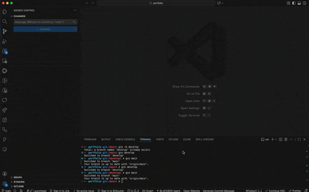

# Branch Note

**Branch Note** is a VS Code extension that helps developers stay organized and productive by attaching notes directly to Git branches. It ensures that important context, reminders, and team knowledge are never lost when switching branches.

## Why Branch Note?

### 1. Shared Branch Context for Teams 🤝
Improve team collaboration by sharing notes directly on a Git branch. When a team member checks out a branch, they instantly see the notes left for that branch—such as implementation details, TODOs, warnings, or handover instructions.

This is especially useful for:
- Code reviews
- Handoffs between developers
- Explaining temporary decisions or work-in-progress states

> **Note:** To enable team-wide sharing, commit the `.branch-notes.json` file to your repository so all team members can access the notes.

---

### 2. Personal Memory When Switching Branches 🧠
If you frequently jump between branches, **Branch Note** acts as your personal reminder system. You can leave notes specific to each branch to capture:
- What you were working on
- What still needs to be done
- Important decisions or tricky logic

When you return to a branch days or weeks later, your notes appear instantly—saving time and mental effort.

---

## Demo

### Create and View Branch Notes
Create a note for the current branch and automatically see it again when you switch back.

### Team Collaboration Across Branches
Notes committed to the repository are shared and visible to every team member who checks out the branch.

---

## Features

- **Branch-Specific Notes**  
  Notes are automatically linked to the currently active Git branch.

- **Contextual Notifications**  
  Get notified of existing notes when you switch to a branch.

- **Team-Friendly by Design**  
  Share notes across the team by committing the notes file to the repository.

- **Easy Note Management**  
  Create, view, and delete notes directly from the VS Code interface.

- **Rich Text Support**  
  _(Coming soon)_ Enhanced formatting for clearer and more expressive notes.

---

## Usage

### Create a Note
- Open the Command Palette  
  `Cmd + Shift + P` / `Ctrl + Shift + P` → **Branch Note: Create Note**
- Or use the shortcut  
  `Cmd + Shift + N` (Mac) / `Ctrl + Shift + N` (Windows / Linux)
- Or click the **Edit** icon in the Branch Notes view

### View Notes
- Notes for the current branch appear in the **Branch Notes** view in the Activity Bar.

### Delete a Note
- Click the **Trash** icon next to the note in the Branch Notes view.

---

## About

**Branch Note** was created to solve a common developer pain point: losing context when switching Git branches. By keeping notes tied to branches, both individuals and teams can work more efficiently and confidently.

---

## Author

**Nazeh Taha**

- **LinkedIn**: https://www.linkedin.com/in/nazeh-taha/
- **Website**: https://www.nazeh-taha.com/

---

**Code with context. Never lose your place again. 🚀**
